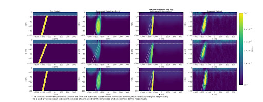

---
title: 'Leveraging Convolutional Neural Networks for implicit regularization in DC resistivity inversions'
abstract: |
  The recent emergence of artificial intelligence has garnered significant attention from researchers, particularly regarding the integration of machine learning algorithms into the inversion algorithm. Researchers in Computer Vision (CV) have discovered that the Convolutional Neural Network (CNN) architecture inherently enforces a prior knowledge that is advantageous for addressing diverse CV inverse problems, including de-noising and inpainting. This inherent regularization effect has been shown to improve models recovered through full waveform inversion of seismic data. Consequently, the utilization of trainable weights within the CNN to parameterize the subsurface map holds promise for potential applicability in other geophysical inversion problems. In this study, we examine the applicability to the inversion of DC resistivity data. The CNN maps an arbitrary vector to the model space (e.g. log-conductivity on the simulation mesh). The predicted subsurface model is fed into the SimPEG numerical simulation package to generate corresponding predicted measurements. Subsequently, the objective function value is computed by comparing these predicted measurements with the observed field measurements. The backpropagation algorithm is employed to update the trainable parameters of the CNN until convergence. Note that the CNN does not require training prior to the inversion, rather, the CNN weights are estimated in the inversion algorithm. Our preliminary work shows that we can recover models that are comparable to, and even superior to that obtained using a standard inversion. For example, we have found that relying on the implicit regularization of the CNN improves the recovery of the dip of a target when a standard L2 or L1 regularization is employed. This method is training-data-free, so it can be adapted to other EM inversion problems.

--- 

[AGU23 e-poster](https://agu23.ipostersessions.com/Default.aspx?s=C6-F6-87-20-DE-67-43-79-FD-E2-69-3E-7C-5A-FA-EF)
